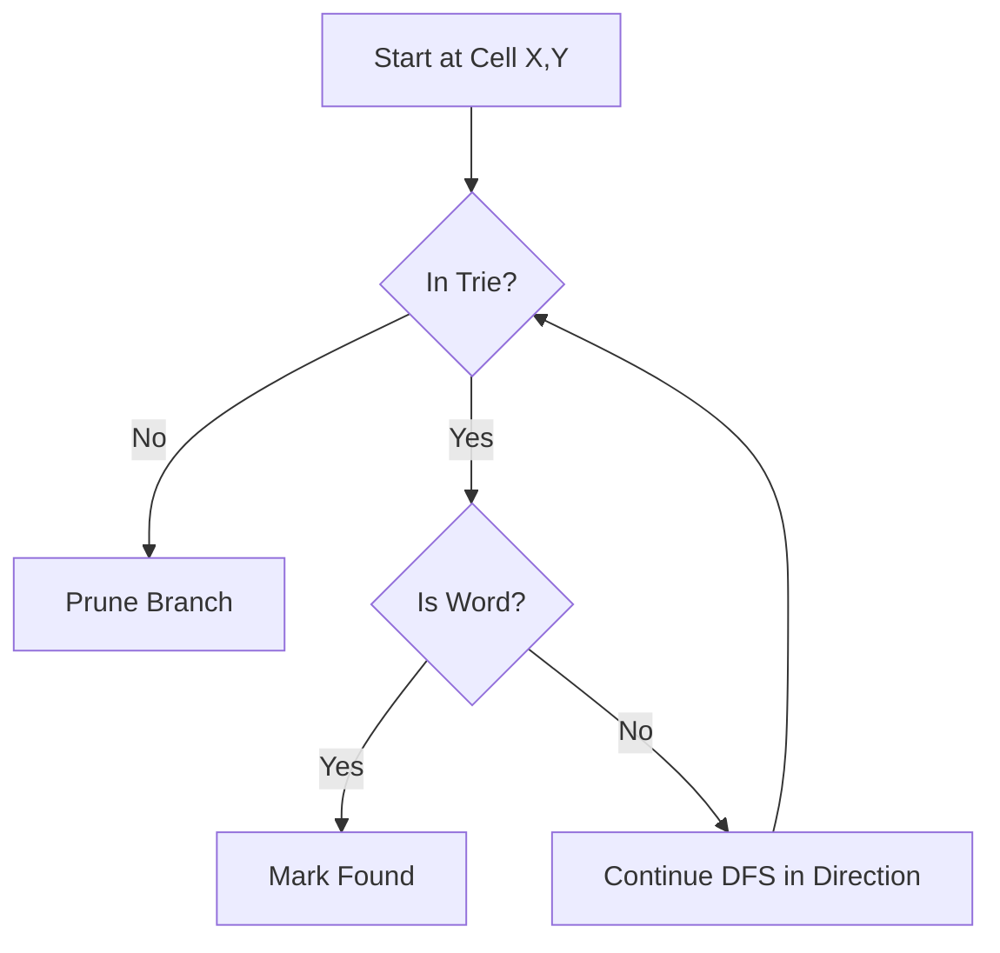

# 🔍 Word Search Master — DSA Edition


<div align="center">

[](https://word-search-generator-tan.vercel.app/)
[](https://reactjs.org/)
[](https://vitejs.dev/)
[](https://opensource.org/licenses/MIT)

**A high-performance, interactive word search puzzle engine demonstrating the practical application of Data Structures and Algorithms.**

[Explore Live Demo](https://word-search-generator-tan.vercel.app/) • [Report Bug](https://github.com/Sm-LumeCode/Word-Search-generator/issues) • [Request Feature](https://github.com/Sm-LumeCode/Word-Search-generator/issues)

</div>

---

## 🚀 Project Overview

Word Search Master is more than just a game; it's a showcase of algorithmic efficiency. Built with **React 18** and **Vite**, it solves complex word search puzzles in milliseconds using a combination of **Trie-based prefix matching** and **Depth-First Search (DFS)**.

> [!IMPORTANT]
> The core objective of this project is to visualize the performance difference between human visual scanning and optimized computational search algorithms.

---

## ✨ Key Features

### 🧩 Content Mode (The Sandbox)
- **Dynamic Grid Scaling**: Custom grid sizes from **3x3 to 20x20**.
- **Intelligent Placement**: Words are hidden in all **8 directions** (Horizontal, Vertical, Diagonal, and Reverse).
- **Collision Detection**: Ensures seamless word overlapping without breaking puzzles.
- **Custom Word Lists**: Use your own words or let the AI auto-generate a theme for you.

### ⚡ Demo Mode (Human vs. AI)
- **Split-Screen Battle**: A side-by-side comparison of manual solving vs. the DSA solver.
- **Real-Time Visualization**: Watch the algorithm "think" as it traverses the grid.
- **Progressive Difficulty**: 5 levels ranging from "Easy" (5x5) to "Expert" (15x15).
- **Speed Metrics**: Accurate timing down to the millisecond.

---

## 📖 DSA Deep Dive

The magic behind the speed lies in two fundamental data structures and algorithms:

### 1. The Trie (Prefix Tree)
Instead of checking each word against the grid (which would be $O(W \times L)$ where $W$ is number of words and $L$ is length), we store the word list in a **Trie**. 
- **Benefit**: Constant time $O(L)$ prefix lookups.
- **Optimization**: If a path in the grid (e.g., "QU") isn't a prefix in the Trie, we prune the search branch immediately.

### 2. Depth-First Search (DFS) with Backtracking
The solver iterates through every cell and explores all 8 directions recursively.



---

## 📊 Performance Benchmark

| Level | Grid Size | Words | Human Avg. | DSA Solver | Speedup |
| :--- | :--- | :--- | :--- | :--- | :--- |
| **Easy** | 5x5 | 3 | 20s | **0.2ms** | ~100,000x |
| **Medium** | 9x9 | 5 | 55s | **0.5ms** | ~110,000x |
| **Expert** | 15x15 | 8 | 180s | **1.2ms** | ~150,000x |

---

## 🛠️ Installation & Setup

1. **Clone the Repository**
   ```bash
   git clone https://github.com/Sm-LumeCode/Word-Search-generator.git
   ```

2. **Navigate to Frontend**
   ```bash
   cd Word-Search-generator/frontend
   ```

3. **Install Dependencies**
   ```bash
   npm install
   ```

4. **Run Locally**
   ```bash
   npm run dev
   ```

---

## 📁 Architecture

```text
word-search-game/
├── frontend/
│   ├── src/
│   │   ├── algorithms/    # Trie, DFS Solver, Generator
│   │   ├── components/    # Reusable UI (Grid, WordList)
│   │   ├── pages/         # Main Views (Landing, Demo, Content)
│   │   └── styles.css     # Glassmorphism Design System
└── assets/                # Documentation media
```

---

## 👥 Authors

- **Surabhi M**
- **Spandana M**
- **T R Karthikeya**

---

<div align="center">
  Developed with ❤️ as a showcase of algorithmic efficiency.
</div>
